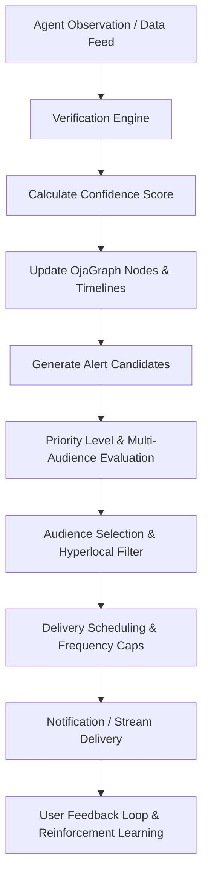

# ALERTGRAPH
## The Intelligence Distribution Layer of the MamaPrice Ecosystem

**Version:** 1.0  
**Status:** Core Architecture Document  
**Owner:** MamaPrice Intelligence Platform  
**Architecture Pillar:** Pillar 3 — Distribution Layer (*alongside OjaGraph, OjaLM, AgentGraph, and TrustGraph*)

---

# Architecture Paradigm

The mistake most products make is treating notifications as a feature. **AlertGraph is not notifications.** It is an **Intelligence Distribution Engine**.

It decides:
* **What happened**
* **Who should know**
* **How important it is**
* **When they should know**
* **How it should be delivered**
* **Whether it should wait or interrupt**
* **Whether it should create another chain reaction**

> **OjaGraph** stores knowledge.  
> **OjaLM** reasons over knowledge.  
> **AlertGraph** distributes knowledge.  

### Paradigm Shift: Search-Pull vs. Alert-Push

Instead of the traditional passive search flow:
$$\text{User} \longrightarrow \text{Search} \longrightarrow \text{Answer}$$

MamaPrice operates as a proactive intelligence engine:
$$\text{World Changes} \longrightarrow \text{OjaGraph Updates} \longrightarrow \text{AlertGraph Detects} \longrightarrow \text{Users Receive Intelligence} \longrightarrow \text{Users Act}$$

People stop opening MamaPrice only when they need to search. They open MamaPrice because MamaPrice continuously watches Nigeria's economy on their behalf and always delivers timely, high-value intelligence.

---

# Hyperlocal Intelligence Mandate

> *"Near you"* is too generic for MamaPrice.

MamaPrice's core strength is **hyperlocal commerce intelligence**. Every alert MUST reference an **exact market, road, district, LGA, state, or landmark** whenever possible.

---

# Mission

AlertGraph exists to ensure that no important change inside the commerce ecosystem goes unnoticed.

It continuously monitors **OjaGraph**. Every update inside OjaGraph becomes a possible intelligence event.

AlertGraph evaluates:
- **Is this important?**
- **Who should know?**
- **When should they know?**
- **How should they receive it?**
- **Can this wait?**
- **Should this interrupt them immediately?**

AlertGraph transforms raw commerce updates into actionable intelligence.

---

# Alert Event Sources

Every node and edge inside OjaGraph can produce alerts across all verticals:

| Category | Node Event Sources |
|---|---|
| **Commodities & Food** | Rice, Tomatoes, Pepper, Eggs, Palm Oil, Flour, Sugar, Livestock, Fisheries |
| **Construction & Industry** | Steel (12mm Rebar), Cement (Dangote/BUA), Roofing Sheets, Timber |
| **Energy & Utilities** | Fuel (PMS/AGO/DPK), Electricity Tariffs, Cooking Gas (LPG) |
| **Macro & Markets** | Exchange Rates (USD/NGN), Inflation Indices, Port Freight (Apapa/Tincan), Customs Tariffs |
| **Real Estate & Rent** | 2-Bed Apartments, Shops, Warehouses, Land Leases |
| **Infrastructure & Civic** | Road Closures, Bridge Traffic, Flooding, Weather, Fuel Scarcity, Security |
| **Social & Academic** | UNILAG/ABU/UI Resumptions, NYSC Orientations, Trade Fairs, Concerts, Football Matches |

---

# Intelligence Event Pipeline

---

# Agent Updates & Trigger Engine

Agents (formerly Scouts) are the primary producers of field intelligence. Every Agent submission immediately enters AlertGraph.

### Agent Trigger Rules & Thresholds:
- **Minor Fluctuation**: Old ₦66,000 $\rightarrow$ New ₦66,100 ($+0.15\%$) $\Rightarrow$ **No Notification**.
- **Major Movement**: Old ₦66,000 $\rightarrow$ New ₦72,000 ($+9.09\%$) $\Rightarrow$ **Alert Candidate Generated**.
- **Low Confidence**: 1 Agent report, Confidence = 41% $\Rightarrow$ **Alert Stays Pending**.
- **High Confidence**: 5 Trusted Agents report, Confidence = 98% $\Rightarrow$ **Published Immediately**.

---

# Multi-Audience Intelligence Routing

The same underlying event is automatically contextualized and routed differently depending on the recipient:

### Event: *Rice price drops 12% in Mile 12 Market, Kosofe LGA, Lagos*

* 👩 **Consumer**: *"Rice (50kg, Mama Gold) dropped ₦81,000 → ₦73,000 at Mile 12 Market, Kosofe LGA, Lagos."*
* 🏪 **Retailer**: *"Competitors in Yaba & Ketu reduced rice prices by 12%. Review pricing strategy."*
* 🚚 **Distributor**: *"Tomatoes demand increased 34% in Mile 12 Market. Increase today's shipment."*
* 🌾 **Farmer**: *"Market prices in Lagos weakened due to increased northern shipments."*
* 🏛 **Government**: *"Rice prices declined across 3 Lagos markets (Mile 12, Oyingbo, Ketu), easing food inflation."*
* 📈 **Analyst**: *"Staple food price index fell 3.2% this week across Kosofe and Ebute Metta hubs."*

---

# Hyperlocal Intelligence Alert Catalog

### 🛒 Consumer Alerts

#### Price Drops:
- 📍 **Mile 12 Market, Kosofe LGA, Lagos**: Rice (50kg, Mama Gold) dropped **₦81,000 → ₦73,000**. Lowest verified price reported 18m ago by 6 Agents.
- 📍 **Oyingbo Market, Ebute Metta, Lagos**: Fresh tomatoes (basket) now **₦15,500** (*Lagos avg ₦18,200 · Save ~₦2,700*).
- 📍 **Bodija Market, Ibadan North LGA, Oyo**: Frozen Chicken (Carton) selling for **₦41,500** (*Was ₦45,000 · Verified by 4 Agents*).

#### Price Increases:
- 📍 **Ariaria International Market, Aba South, Abia**: Dangote Cement 50kg increased by **₦1,200** today (**₦8,500 → ₦9,700**) due to transport delays.

#### Buy Before Price Increases:
- 📍 **Oil Mill Market, Port Harcourt**: Palm Oil prices expected to increase within 48h (*Early buying recommended · 91% Confidence*).

#### Best Deal Nearby:
- 📍 **Onitsha Main Market**: Rice (50kg) ₦72,800 · Beans (Paint) ₦8,300 · Groundnut Oil (25L) ₦39,500 (*Verified from 11 Agent reports*).

#### Restock & Flash Deals:
- 📍 **Sabon Gari Market, Kano**: Sugar back in stock after 6 days (**₦82,000**).
- 📍 **Ketu Market, Lagos**: Flash Deal — Irish Potatoes **₦28,000** (*Normal ₦36,000*).

---

### 🚚 Distributor Alerts
- 📍 **Mile 12 Market, Lagos**: Demand for tomatoes increased by **34%** this morning. Wholesalers restocking rapidly.
- 📍 **Aba Timber Market, Abia**: Demand for roofing sheets rising. Inventory may sell out in 3 days.
- 📍 **Bodija Market, Oyo**: Supply shortage detected for onions (*Kano deliveries down 27%*).

---

### 🏪 Retailer Alerts
- 📍 **Yaba Market, Lagos**: Nearby competitors reduced Indomie Super Pack by **9%**.
- 📍 **Ogbete Main Market, Enugu**: 5 neighboring stores reduced vegetable oil prices to **₦14,500** (*Your average: ₦15,600*).
- 📍 **Computer Village, Ikeja**: Competitors discounting phone chargers by **18%**.

---

### 🏭 Manufacturer Alerts
- 📍 **Lagos (Lekki, Ikorodu, Agege, Badagry)**: Cement demand forecast **+18%** within 7 days.
- 📍 **South-East Nigeria**: Building materials demand risen following federal road contracts.

---

### 🚛 Logistics Alerts
- 📍 **Lokoja → Abuja Corridor**: Heavy truck delays (8–14h delay). Affected: Rice, Cement, Flour.
- 📍 **Lagos–Ibadan Expressway**: Traffic slowing deliveries into Bodija Market & Oje Market.

---

### 💰 Agent Alerts
- 📍 **Mile 12 Market**: Report approved (+35 Agent Points, ₦250 pending payout).
- 📍 **Lagos State**: Ranked **#12** among Lagos Agents.
- 📍 **Oyingbo Market**: Bonus mission available (+150 bonus points).

---

### 📊 Government & Emergency Alerts
- 📍 **Federal Ministry of Agriculture**: Rice prices increased **17%** across Kano, Kaduna & Abuja.
- 📍 **Mile 12 Market, Kosofe**: Fire incident in vegetable section · Section temporarily closed.
- 📍 **Onitsha Main Market**: Flooding affecting access roads · Produce shortages expected.
- 📍 **Kano Grain Market**: Truck drivers' strike affecting grain deliveries.

---

### 🧠 AI Insights & Predictive Intelligence
- 📍 **Bodija Market, Ibadan**: MamaPrice AI predicts beans prices will rise **8–11%** over 5 days due to reduced northern supply, transport costs & wholesale demand (*92% Confidence*).

---

# Architecture Map

AlertGraph completes the 5 core pillars of the MamaPrice Commerce Intelligence Architecture:

1. **OjaGraph.md** — Knowledge Layer *(Graph DB & Document Store)*
2. **OjaLM.md** — Reasoning Layer *(Fine-Tuned LLM & RAG Engine)*
3. **AlertGraph.md** — Distribution Layer *(Hyperlocal Intelligence Routing)*
4. **AgentGraph.md** — Human Intelligence Layer *(Field Scout Network & Verification)*
5. **TrustGraph.md** — Verification & Reputation Layer *(Confidence & Anti-Counterfeit)*
