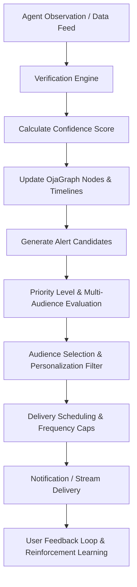

# ALERTGRAPH
## The Intelligence Distribution Layer of the MamaPrice Ecosystem

**Version:** 1.0  
**Status:** Core Architecture Document  
**Owner:** MamaPrice Intelligence Platform  
**Architecture Pillar:** Pillar 3 — Distribution Layer (*alongside OjaGraph, OjaLM, AgentGraph, and TrustGraph*)

---

# Architecture Paradigm

The mistake most products make is treating notifications as a feature. **AlertGraph is not notifications.** It is an **Intelligence Distribution Engine**.

It decides:
* **What happened**
* **Who should know**
* **How important it is**
* **When they should know**
* **How it should be delivered**
* **Whether it should wait or interrupt**
* **Whether it should create another chain reaction**

> **OjaGraph** stores knowledge.  
> **OjaLM** reasons over knowledge.  
> **AlertGraph** distributes knowledge.  

### Paradigm Shift: Search-Pull vs. Alert-Push

Instead of the traditional passive search flow:
$$\text{User} \longrightarrow \text{Search} \longrightarrow \text{Answer}$$

MamaPrice operates as a proactive intelligence engine:
$$\text{World Changes} \longrightarrow \text{OjaGraph Updates} \longrightarrow \text{AlertGraph Detects} \longrightarrow \text{Users Receive Intelligence} \longrightarrow \text{Users Act}$$

People stop opening MamaPrice only when they need to search. They open MamaPrice because MamaPrice continuously watches Nigeria's economy on their behalf and always delivers timely, high-value intelligence.

---

# Mission

AlertGraph exists to ensure that no important change inside the commerce ecosystem goes unnoticed.

It continuously monitors **OjaGraph**. Every update inside OjaGraph becomes a possible intelligence event.

AlertGraph evaluates:
- **Is this important?**
- **Who should know?**
- **When should they know?**
- **How should they receive it?**
- **Can this wait?**
- **Should this interrupt them immediately?**

AlertGraph transforms raw commerce updates into actionable intelligence.

---

# Alert Event Sources

Every node and edge inside OjaGraph can produce alerts across all verticals:

| Category | Node Event Sources |
|---|---|
| **Commodities & Food** | Rice, Tomatoes, Pepper, Eggs, Palm Oil, Flour, Sugar, Livestock, Fisheries |
| **Construction & Industry** | Steel (12mm Rebar), Cement (Dangote/BUA), Roofing Sheets, Timber |
| **Energy & Utilities** | Fuel (PMS/AGO/DPK), Electricity Tariffs, Cooking Gas (LPG) |
| **Macro & Markets** | Exchange Rates (USD/NGN), Inflation Indices, Port Freight (Apapa/Tincan), Customs Tariffs |
| **Real Estate & Rent** | 2-Bed Apartments, Shops, Warehouses, Land Leases |
| **Infrastructure & Civic** | Road Closures, Bridge Traffic, Flooding, Weather, Fuel Scarcity, Security |
| **Social & Academic** | UNILAG/ABU/UI Resumptions, NYSC Orientations, Trade Fairs, Concerts, Football Matches |

Every node inside OjaGraph is capable of becoming an event source.

---

# Intelligence Event Pipeline

---

# Agent Updates & Trigger Engine

Agents (formerly Scouts) are the primary producers of field intelligence. Every Agent submission immediately enters AlertGraph.

### Example Ingestion & Graph Update Flow:
1. **Agent Submits Report**: Rice (50kg) = ₦72,000 at Mile 12 Market (09:42 AM).
2. **Verification Engine**: Compare with historical prices, vendor receipts, and nearby agent reports.
3. **Confidence Score**: Assign confidence weight (0.00 – 1.00).
4. **Graph Updates**: Update Product Node $\rightarrow$ Market Node $\rightarrow$ Vendor Node $\rightarrow$ Price Timeline.
5. **Generate Alert Candidates**: Submit to AlertGraph trigger evaluation.

### Can Agent Reports Trigger Notifications?
**YES.** Absolutely. But **NOT automatically**. Every report is strictly evaluated first.

### Agent Trigger Rules & Thresholds:

#### Price Movement Threshold Rule:
- **Minor Fluctuation**: Old ₦66,000 $\rightarrow$ New ₦66,100 ($+0.15\%$) $\Rightarrow$ **No Notification** (Logged silently).
- **Major Movement**: Old ₦66,000 $\rightarrow$ New ₦72,000 ($+9.09\%$) $\Rightarrow$ **Alert Candidate Generated**.

#### Confidence Threshold Rule:
- **Low Confidence**: 1 Agent report, Confidence = 41% $\Rightarrow$ **Alert Stays Pending** (Awaiting verification).
- **High Confidence**: 5 Trusted Agents report, Confidence = 98% $\Rightarrow$ **Published Immediately**.

---

# Confidence Engine & Scoring Matrix

Every alert candidate has a calculated confidence score:

$$\text{Confidence} = f(\text{Agent Count}, \text{Agent Accuracy Rating}, \text{GPS Proximity}, \text{Photo Evidence}, \text{Market Consistency})$$

| Confidence Range | Action / Handling |
|---|---|
| **0% – 40%** | **Ignore** (Discard candidate) |
| **40% – 70%** | **Needs Verification** (Dispatch verification mission to nearby Agents) |
| **70% – 90%** | **Publish Carefully** (Deliver to high-threshold subscribers) |
| **90% – 100%** | **Verified** (Publish immediately across all target channels) |

---

# Alert Priority Levels & Interrupt Policy

| Level | Priority | Interruption Policy | Examples |
|---|---|---|---|
| **LEVEL 1** | **Critical** | Immediate Interruption (System Alert) | Severe food shortage, market fire, flooding, fuel crisis, government emergency |
| **LEVEL 2** | **High** | Immediate Push Notification | Rice up 18%, fuel price change, major road closure, university resumption |
| **LEVEL 3** | **Normal** | Grouped Notification / Stream | New vendor onboarding, weekly market trends, supply updates |
| **LEVEL 4** | **Low** | Digest / Summary Only | Historical price trends, recommendations, weekly insights |

---

# Delivery Timing & Intelligent Scheduling

AlertGraph schedules delivery to maximize actionability without causing alert fatigue:

* **Immediate**: Critical & High Priority (Emergencies, major price jumps, road closures).
* **Hourly Digest**: Small updates, price movements, market summaries.
* **Morning Intelligence (07:00 AM)**: Overnight updates, best deals nearby, price drops, trending markets, weather impact.
* **Lunch Summary (12:00 PM)**: Busy market alerts, traffic, wholesale opportunities.
* **Evening Intelligence (06:00 PM)**: Daily price movements, agent activity, best buys for tomorrow.
* **Night Summary (09:00 PM)**: Market closing recaps, daily summaries, tomorrow's price outlook.
* **Weekly Intelligence (Every Monday)**: Top price movements, cheapest markets, fastest-growing commodities, agent leaderboard.
* **Monthly Intelligence**: Inflation index, market rankings, price indices, economic summaries.

---

# Multi-Audience Intelligence Routing ("The Killer Feature")

The same underlying event is automatically contextualized and routed differently depending on the recipient:

### Event: *Rice price drops 12% in Mile 12 Market*

* 👩 **Consumer**: *"Rice is now ₦8,000 cheaper near you. Buy today at Mile 12."*
* 🏪 **Retailer**: *"Competitors reduced rice prices by 12%. Consider adjusting your pricing."*
* 🚚 **Distributor**: *"Demand for rice is expected to increase in Mile 12 due to price drop."*
* 🌾 **Farmer**: *"Market prices have weakened in Lagos due to increased supply."*
* 🏛 **Government**: *"Rice prices declined across 3 major Lagos markets, suggesting improved regional supply."*
* 📈 **Investor / Analyst**: *"Staple food price index fell 3.2% this week, driven primarily by rice."*

AlertGraph is an **intelligence routing engine**, delivering the same underlying event in the exact format required for each persona.

---

# Social Intelligence Alerts ("Living Network")

Social Intelligence Alerts do not come from automated feeds—they emerge directly from collective Agent activity:

> 🟢 **12 Agents just reported that tomatoes are selling out quickly in Mile 12.**  
> 🔥 **26 Agents are currently active in Balogun Market.**  
> 📈 **57 Agents have reported rising cement prices across Lagos in the last 2 hours.**  
> 🚨 **Three independent Agents reported fuel scarcity in Surulere. Verification in progress.**  

This creates a "living network" feeling, reinforcing the value of the human Agent network in real time.

---

# Core Alert Categories & Stream Examples

### 🥬 Price Drop & Increase Alerts
- 🟢 **Rice (50kg)**: Dropped from ₦74,000 $\rightarrow$ ₦69,500 (*Mile 12 · Verified by 14 Agents*)
- 🔻 **Tomatoes**: 18% cheaper (*₦2,800 $\rightarrow$ ₦2,300 · Jos*)
- 🔴 **Dangote Cement**: Rising ₦10,500 $\rightarrow$ ₦11,300 (*+7.6% · Lagos*)
- ⛽ **Fuel Price**: Increased ₦940 $\rightarrow$ ₦995/L (*May affect transport & food prices*)

### 🏪 Market & Logistics Alerts
- 🟢 **Mile 12 Market**: Open · 1,274 shoppers, 96 active Agents
- 🚧 **Third Mainland Bridge**: Heavy traffic · Estimated delay: 42 mins
- 🚨 **Bodija Market**: Fire reported near market · Authorities responding

### 👩🏾🌾 Agent Network & Gamification Alerts
- 🏆 **Mission Completed**: Earned +250 Agent Points & ₦2,400 payout
- 🔥 **Report Verified**: Confidence 98% · +80 XP
- 🥇 **Rank Updated**: Ranked #34 among all Lagos Agents

### 🏛 Government & Policy Alerts
- 🚨 **Food Inflation Warning**: Beans increased 18% across 5 states
- 🚛 **Import Restriction**: Announced on imported rice

### 🤖 AI Predictive Insights
- 🧠 **MamaPrice Predicts**: Rice prices may increase by 8–12% within 2 weeks due to rising fuel costs and lower northern supply.

---

# Ecosystem Architecture Map

AlertGraph completes the 5 core pillars of the MamaPrice Commerce Intelligence Architecture:

1. **OjaGraph.md** — Knowledge Layer *(Graph DB & Document Store)*
2. **OjaLM.md** — Reasoning Layer *(Fine-Tuned LLM & RAG Engine)*
3. **AlertGraph.md** — Distribution Layer *(Intelligence Routing & Notification Engine)*
4. **AgentGraph.md** — Human Intelligence Layer *(Field Scout Network & Verification)*
5. **TrustGraph.md** — Verification & Reputation Layer *(Confidence & Anti-Counterfeit)*

Together, these five pillars form the complete real-time commerce intelligence engine for Africa.
