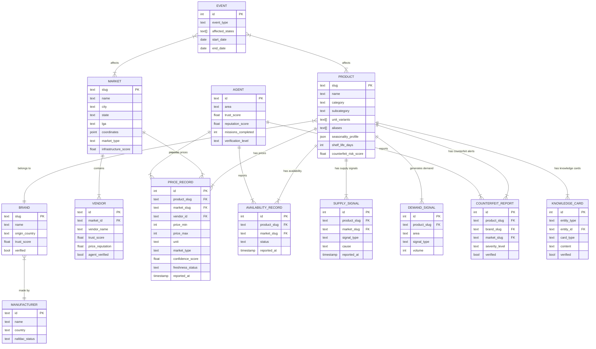
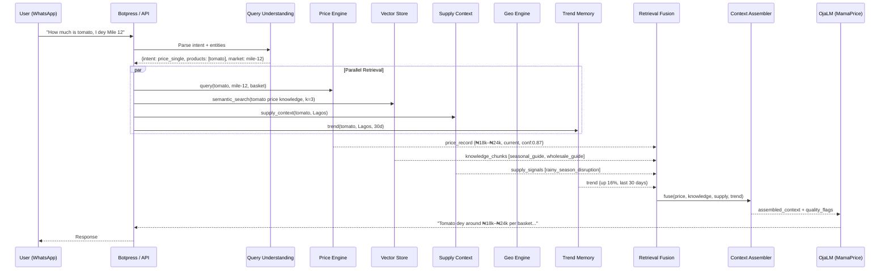
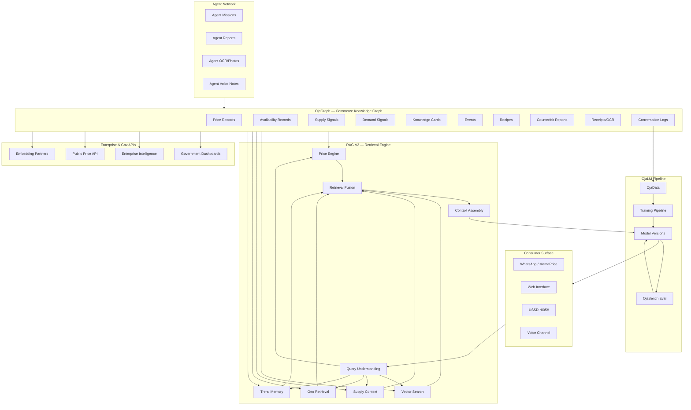

# MARKETMAMA COMMERCE INTELLIGENCE ARCHITECTURE
## OjaGraph · OjaLM · RAG V2
### Version 2.0 — Engineering Specification

**Classification:** Internal Architecture Document
**Status:** Active
**Replaces:** Price Engine Spec v1.0, RAG Spec v1.0, OjaGraph Schema v0.1

---

## Preamble — Philosophy Change

This document supersedes all previous architecture specifications.

The previous architecture was centred around price.
Price was treated as the product.
That model is obsolete.

**Price is one attribute inside Commerce Intelligence.
It is a node in OjaGraph. Nothing more.**

MarketMama is not building a price checker.
MarketMama is not building a chatbot.
MarketMama is not building an LLM.

MarketMama is building the **Commerce Intelligence Infrastructure for Africa.**

The consumer surface is **MamaPrice.**
The intelligence model is **OjaLM.**
The knowledge graph is **OjaGraph.**
The dataset is **OjaData.**
The contributor network is the **Agent Network.**

OjaLM is to MamaPrice what GPT is to ChatGPT.
The model is not the product.
The product is the intelligence platform.
The moat is the flywheel.

---

## The Flywheel — The Only Moat That Matters

Every architectural decision in this document must serve the flywheel.
Not the model. Not the UI. Not the API.
The flywheel.

```
┌─────────────────────────────────────────────────────┐
│                                                     │
│   Users ──────────────────────────────────────┐    │
│     │                                         │    │
│     ▼                                         │    │
│   MamaPrice Conversations                     │    │
│     │                                         │    │
│     ▼                                         │    │
│   Commerce Intelligence Signals               │    │
│     │                                         │    │
│     ▼                                         │    │
│   Agents (Human Contributors)                 │    │
│     │                                         │    │
│     ▼                                         │    │
│   OjaGraph (Commerce Knowledge Graph)         │    │
│     │                                         │    │
│     ▼                                         │    │
│   OjaData (Commerce Intelligence Dataset)     │    │
│     │                                         │    │
│     ▼                                         │    │
│   OjaLM Training Pipeline                     │    │
│     │                                         │    │
│     ▼                                         │    │
│   New OjaLM Version                           │    │
│     │                                         │    │
│     ▼                                         │    │
│   Better MamaPrice ───────────────────────────┘    │
│                                                     │
│              Repeat. Compound. Forever.             │
└─────────────────────────────────────────────────────┘
```

Every feature, every API, every Agent mission, every schema decision
exists to accelerate this flywheel. If a component does not feed
the flywheel, it should not be built.

---

# PART I — OJAGRAPH
## Commerce Knowledge Graph

---

## 1.1 What OjaGraph Is

OjaGraph is the Commerce Knowledge Graph that powers the entire
MarketMama ecosystem. It is not a price database. It is not a
product catalogue. It is not a market directory.

It is a living, continuously updated, interconnected graph of
everything that constitutes commerce in African markets:

- What things are (Products, Brands, Manufacturers)
- Where commerce happens (Markets, Vendors, Locations)
- Who participates (Consumers, Agents, Merchants)
- What things cost (Prices — one attribute among many)
- What is available (Supply, Availability, Stock)
- What people want (Demand, Intent, Preferences)
- What things are worth (Value, Quality, Alternatives)
- What is happening (Events, Trends, Seasonality)
- What is dangerous (Counterfeits, Fraud, Violations)
- What government needs (Statistics, Policy, Surveillance)
- What researchers study (Economics, Food Security, Agriculture)

OjaGraph is the knowledge base of African commerce.
OjaLM learns from it. MamaPrice queries it. Agents enrich it.
Government dashboards read from it. Enterprise APIs are built on it.

---

## 1.2 Core Entities

### Primary Entities

```
PRODUCT
  A good or service sold in African markets.
  Has: name, slug, category, subcategory, unit variants,
       brand (optional), manufacturer (optional),
       description, aliases, images, knowledge_card,
       seasonality_profile, shelf_life, counterfeit_risk,
       regulatory_status

BRAND
  The commercial identity behind a product.
  Has: name, slug, logo, origin_country, category,
       products[], markets_present[], manufacturer,
       authenticity_signals, known_counterfeits[],
       verified, trust_score

MANUFACTURER
  The entity that produces goods.
  Has: name, location, country, brands[], products[],
       registration_number, nafdac_status, regulatory_flags

MARKET
  A physical trading location.
  Has: name, slug, city, state, lga, coordinates,
       market_type (wholesale|retail|specialized),
       opening_days, opening_hours, specializations[],
       vendor_count, agent_coverage, verified,
       infrastructure_score (power, water, access)

VENDOR
  A seller operating within a market.
  Has: market_id, stall_id, vendor_name, categories[],
       products_sold[], price_reputation, trust_score,
       agent_verified, accepts_transfer, accepts_usdc,
       operating_hours, typical_stock_days

STATE / LGA / WARD
  Nigerian administrative geography.
  Has: name, code, region, parent_id,
       market_ids[], commerce_profile, population_est,
       urban_rural_ratio

CONSUMER
  A MamaPrice user.
  Has: user_id (hashed), area, state, usage_pattern,
       query_history (anonymized), preferences,
       purchase_context (home|trade|business),
       household_size (optional)

AGENT
  A registered human contributor to OjaGraph.
  Has: agent_id, name, phone_hash, area, markets_covered[],
       trust_score, reputation_score, verification_level,
       badges[], expertise_tags[], missions_completed,
       income_earned, fraud_flags, active_status,
       report_history[], agent_dna (see Agent DNA below)

PRICE_RECORD
  One price observation. A node, not the graph.
  Has: product_id, vendor_id (optional), market_id,
       city, state, unit, price_min, price_max,
       market_type (wholesale|retail), source_type,
       agent_id (if crowdsourced), reported_at,
       verified, confidence_score, freshness_status,
       purchase_context

AVAILABILITY_RECORD
  Whether something is in stock.
  Has: product_id, market_id, vendor_id (optional),
       status (in_stock|low_stock|out_of_stock),
       reported_at, agent_id, confidence_score

DEMAND_SIGNAL
  Evidence of consumer intent or demand.
  Has: product_id, area, signal_type
       (query|search|purchase_intent|basket),
       volume, period, source (mamaprice|agent_report)

SUPPLY_SIGNAL
  Evidence of supply availability or shortage.
  Has: product_id, market_id, signal_type
       (abundance|normal|shortage|disruption),
       cause (seasonal|transport|import|weather|policy),
       reported_at, agent_id, confidence_score

COUNTERFEIT_REPORT
  A report of fake or adulterated goods.
  Has: product_id, brand_id (optional), market_id,
       vendor_id (optional), description, image_ids[],
       reporter_agent_id, reported_at, verified,
       nafdac_reported, severity_level

RECEIPT
  A scanned market receipt.
  Has: image_id, ocr_text, parsed_items[],
       market_id (if identified), total_amount,
       receipt_date, agent_id, consumer_id,
       parsing_confidence, items_verified

EVENT
  A market-affecting occurrence.
  Has: event_type (harvest|flood|strike|festival|
                   policy_change|import_ban|fuel_hike),
       affected_products[], affected_markets[],
       affected_states[], start_date, end_date,
       price_impact_est, supply_impact_est, source

KNOWLEDGE_CARD
  A structured fact about a product, brand, or market.
  Has: entity_type, entity_id, card_type
       (how_to_buy|how_to_identify|how_to_store|
        seasonal_guide|wholesale_guide|alternatives),
       content, author (agent|admin|research),
       verified, last_reviewed

RECIPE / FOOD_GUIDE
  A cooking guide that connects to products.
  Has: name, cuisine_type, ingredients[],
       ingredient_quantities[], preparation_steps,
       estimated_cost, regional_variations,
       seasonal_availability

RESEARCH_REPORT
  Government or academic document.
  Has: title, source_org, report_type, date_published,
       states_covered[], products_covered[],
       key_findings, data_citations[], pdf_id

CONVERSATION_LOG
  Anonymized MamaPrice conversation (for training).
  Has: session_id (hashed), messages[],
       intents_detected[], entities_extracted[],
       resolution_type (answered|estimated|unknown),
       user_satisfaction_signal, timestamp
```

---

## 1.3 Entity Relationship Model



---

## 1.4 Agent DNA

Agent DNA is a structured profile that captures what each
human agent knows, where they operate, and how much to
trust their reports.

```json
{
  "agent_id": "AGT-04821",
  "verification_level": "verified",
  "trust_score": 0.87,
  "reputation_score": 0.91,
  "expertise_tags": [
    "fresh_produce",
    "Mile_12",
    "wholesale",
    "crayfish",
    "palm_oil"
  ],
  "markets_covered": [
    { "market_slug": "mile-12", "primary": true, "visit_frequency": "daily" },
    { "market_slug": "oyingbo", "primary": false, "visit_frequency": "weekly" }
  ],
  "report_stats": {
    "total_submitted": 847,
    "total_verified": 804,
    "total_rejected": 12,
    "total_flagged": 31,
    "acceptance_rate": 0.949,
    "avg_deviation_from_consensus": 0.047
  },
  "badges": [
    "founding_agent",
    "mile12_expert",
    "produce_specialist",
    "100_missions",
    "zero_fraud"
  ],
  "fraud_flags": 0,
  "income_earned_naira": 247500,
  "level": "expert",
  "active": true
}
```

Agent DNA directly influences:
- Which missions are assigned (expertise matching)
- How much auto-verification weight their reports carry
- What trust multiplier is applied to their price records
- What level of mission they are eligible for

---

## 1.5 Commerce Knowledge Graph — Storage Architecture

OjaGraph is implemented as a hybrid storage system.
Different entity types have different optimal storage backends.

```
Storage Layer        Used For                    Backend
─────────────────────────────────────────────────────────────────
Relational DB        Price records, Agents,       PostgreSQL
                     Vendors, Markets,
                     Availability, structured
                     queryable data

Vector Store         Product descriptions,        pgvector (same PG)
                     Knowledge cards, recipes,
                     conversation logs,
                     semantic search targets

Graph Layer          Entity relationships,         PostgreSQL +
                     network traversal,            JSONB graph edges
                     recommendations,              (Phase 1)
                     alternative products          → Neo4j (Phase 3)

Object Storage       Images, receipts, PDFs,       S3 / Cloudflare R2
                     voice recordings, OCR raw

Document Store       Research reports,             PostgreSQL JSONB
                     government bulletins,
                     structured knowledge cards

Cache Layer          Frequently queried prices,    Redis
                     active sessions, leaderboard,
                     hot search results
```

Phase 1 (current): PostgreSQL + pgvector + Redis + S3.
Phase 3 (scale): Neo4j for graph traversal when relationship
queries become a bottleneck.

---

## 1.6 Full PostgreSQL Schema

```sql
-- ============================================
-- OJAGRAPH SCHEMA v2.0
-- Commerce Knowledge Graph
-- ============================================

-- Extension requirements
CREATE EXTENSION IF NOT EXISTS vector;
CREATE EXTENSION IF NOT EXISTS pg_trgm;  -- fuzzy text search
CREATE EXTENSION IF NOT EXISTS postgis;  -- geographic queries

-- ============================================
-- GEOGRAPHY
-- ============================================

CREATE TABLE states (
  code        TEXT PRIMARY KEY,    -- "LA", "AB", "KN"
  name        TEXT NOT NULL,       -- "Lagos", "Abuja", "Kano"
  region      TEXT,                -- "SW", "NC", "NW"
  population  INTEGER
);

CREATE TABLE lgas (
  id          SERIAL PRIMARY KEY,
  state_code  TEXT REFERENCES states(code),
  name        TEXT NOT NULL,
  urban_rural TEXT                 -- "urban", "peri-urban", "rural"
);

-- ============================================
-- COMMERCE ENTITIES
-- ============================================

CREATE TABLE manufacturers (
  id              TEXT PRIMARY KEY,
  name            TEXT NOT NULL,
  country         TEXT,
  nafdac_status   TEXT,            -- "registered", "flagged", "unknown"
  regulatory_flags TEXT[]
);

CREATE TABLE brands (
  slug            TEXT PRIMARY KEY,
  name            TEXT NOT NULL,
  manufacturer_id TEXT REFERENCES manufacturers(id),
  origin_country  TEXT,
  category        TEXT,
  trust_score     DECIMAL DEFAULT 0.80,
  verified        BOOLEAN DEFAULT FALSE,
  known_fakes     TEXT[],          -- known counterfeit identifiers
  authenticity_signals TEXT[]      -- how to verify real product
);

CREATE TABLE products (
  slug                  TEXT PRIMARY KEY,
  name                  TEXT NOT NULL,
  brand_slug            TEXT REFERENCES brands(slug),
  category              TEXT NOT NULL,
  subcategory           TEXT,
  description           TEXT,
  unit_variants         TEXT[],    -- ["basket","kg","paint","derica"]
  default_unit          TEXT,
  unit_kg_equiv         JSONB,     -- {"basket": 28, "paint": 3.5}
  aliases               TEXT[],    -- ["tomatoe","toms","fresh tomato"]
  seasonality_profile   JSONB,     -- monthly price pressure index
  shelf_life_days       INTEGER,
  counterfeit_risk      TEXT,      -- "low","medium","high"
  regulatory_status     TEXT,
  nafdac_number         TEXT,
  embedding             vector(1536),  -- product semantic embedding
  knowledge_card_id     INTEGER,
  created_at            TIMESTAMP DEFAULT NOW(),
  updated_at            TIMESTAMP DEFAULT NOW()
);

CREATE TABLE product_aliases (
  id          SERIAL PRIMARY KEY,
  product_slug TEXT REFERENCES products(slug),
  alias       TEXT NOT NULL,
  language    TEXT DEFAULT 'en',   -- "en","pcm" (pidgin)
  created_at  TIMESTAMP DEFAULT NOW()
);
CREATE INDEX ON product_aliases USING gin(alias gin_trgm_ops);

-- ============================================
-- MARKETS AND VENDORS
-- ============================================

CREATE TABLE markets (
  slug              TEXT PRIMARY KEY,
  name              TEXT NOT NULL,
  city              TEXT NOT NULL,
  state_code        TEXT REFERENCES states(code),
  lga_id            INTEGER REFERENCES lgas(id),
  coordinates       GEOMETRY(Point, 4326),
  market_type       TEXT,   -- "wholesale","retail","specialized","mixed"
  specializations   TEXT[], -- ["fresh_produce","protein","grains"]
  opening_days      TEXT[], -- ["MON","TUE","WED","THU","FRI","SAT"]
  opening_hours     JSONB,  -- {"open": "06:00", "close": "19:00"}
  vendor_count_est  INTEGER,
  agent_coverage    DECIMAL, -- 0.0-1.0 coverage score
  infrastructure    JSONB,   -- {"power": 0.6, "water": 0.8, "access": 0.9}
  verified          BOOLEAN DEFAULT FALSE,
  created_at        TIMESTAMP DEFAULT NOW()
);

CREATE TABLE vendors (
  id                TEXT PRIMARY KEY,
  market_slug       TEXT REFERENCES markets(slug),
  vendor_name       TEXT,
  stall_reference   TEXT,
  categories        TEXT[],
  products_sold     TEXT[],
  trust_score       DECIMAL DEFAULT 0.50,
  price_reputation  DECIMAL DEFAULT 0.50, -- 1.0 = always fair
  agent_verified    BOOLEAN DEFAULT FALSE,
  accepts_transfer  BOOLEAN DEFAULT FALSE,
  accepts_usdc      BOOLEAN DEFAULT FALSE,
  phone             TEXT,   -- encrypted
  operating_hours   JSONB,
  created_at        TIMESTAMP DEFAULT NOW(),
  updated_at        TIMESTAMP DEFAULT NOW()
);

-- ============================================
-- AGENTS (Human Contributors)
-- ============================================

CREATE TABLE agents (
  id                  TEXT PRIMARY KEY,
  name                TEXT NOT NULL,
  phone_hash          TEXT UNIQUE,      -- hashed, never plain
  area                TEXT,
  state_code          TEXT REFERENCES states(code),
  verification_level  TEXT DEFAULT 'starter',
                      -- starter|verified|expert|founding
  trust_score         DECIMAL DEFAULT 0.50,
  reputation_score    DECIMAL DEFAULT 0.50,
  expertise_tags      TEXT[],
  badges              TEXT[],
  missions_completed  INTEGER DEFAULT 0,
  missions_rejected   INTEGER DEFAULT 0,
  fraud_flags         INTEGER DEFAULT 0,
  income_earned       INTEGER DEFAULT 0, -- in Naira
  active              BOOLEAN DEFAULT TRUE,
  streak_days         INTEGER DEFAULT 0,
  streak_shields      INTEGER DEFAULT 1,
  last_mission_at     TIMESTAMP,
  payout_method       TEXT,   -- "opay","palmpay","kuda","bank"
  payout_reference    TEXT,   -- encrypted account reference
  referrer_agent_id   TEXT REFERENCES agents(id),
  level               TEXT DEFAULT 'starter',
  created_at          TIMESTAMP DEFAULT NOW()
);

CREATE TABLE agent_markets (
  agent_id          TEXT REFERENCES agents(id),
  market_slug       TEXT REFERENCES markets(slug),
  primary_market    BOOLEAN DEFAULT FALSE,
  visit_frequency   TEXT,    -- "daily","weekly","monthly"
  PRIMARY KEY (agent_id, market_slug)
);

-- ============================================
-- COMMERCE INTELLIGENCE RECORDS
-- ============================================

CREATE TABLE price_records (
  id                SERIAL PRIMARY KEY,
  product_slug      TEXT REFERENCES products(slug),
  market_slug       TEXT REFERENCES markets(slug),
  vendor_id         TEXT REFERENCES vendors(id),
  unit              TEXT NOT NULL,
  price_min         INTEGER NOT NULL,
  price_max         INTEGER NOT NULL,
  market_type       TEXT,   -- "wholesale","retail","supermarket"
  purchase_context  TEXT,   -- "home_use","bulk_trade","any"
  source_type       TEXT,   -- "agent_report","receipt_ocr",
                            --  "admin_manual","partner_api","scraped"
  agent_id          TEXT REFERENCES agents(id),
  reported_at       TIMESTAMP DEFAULT NOW(),
  verified          BOOLEAN DEFAULT FALSE,
  confidence_score  DECIMAL DEFAULT 0.50,
  freshness_status  TEXT,   -- "current","last_week","stale","expired"
  data_freshness    TEXT,   -- "daily","weekly","monthly"
  notes             TEXT,
  image_ids         TEXT[]  -- linked photos if any
);

CREATE TABLE availability_records (
  id              SERIAL PRIMARY KEY,
  product_slug    TEXT REFERENCES products(slug),
  market_slug     TEXT REFERENCES markets(slug),
  vendor_id       TEXT REFERENCES vendors(id),
  status          TEXT NOT NULL,  -- "in_stock","low_stock","out_of_stock"
  quantity_est    TEXT,  -- "abundant","normal","low","critical"
  agent_id        TEXT REFERENCES agents(id),
  reported_at     TIMESTAMP DEFAULT NOW(),
  confidence_score DECIMAL
);

CREATE TABLE supply_signals (
  id              SERIAL PRIMARY KEY,
  product_slug    TEXT REFERENCES products(slug),
  market_slug     TEXT REFERENCES markets(slug),
  signal_type     TEXT,  -- "abundance","normal","shortage","disruption"
  cause           TEXT,  -- "seasonal","transport","flood","import_ban",
                         --  "harvest","strike","fuel_hike","policy"
  severity        TEXT,  -- "low","medium","high","critical"
  affected_states TEXT[],
  agent_id        TEXT REFERENCES agents(id),
  reported_at     TIMESTAMP DEFAULT NOW(),
  notes           TEXT
);

CREATE TABLE demand_signals (
  id              SERIAL PRIMARY KEY,
  product_slug    TEXT REFERENCES products(slug),
  area            TEXT,
  state_code      TEXT REFERENCES states(code),
  signal_type     TEXT,  -- "query","search","purchase_intent","basket"
  volume          INTEGER,
  period_start    DATE,
  period_end      DATE,
  source          TEXT   -- "mamaprice","agent_observation","market_data"
);

CREATE TABLE counterfeit_reports (
  id              SERIAL PRIMARY KEY,
  product_slug    TEXT REFERENCES products(slug),
  brand_slug      TEXT REFERENCES brands(slug),
  market_slug     TEXT REFERENCES markets(slug),
  vendor_id       TEXT REFERENCES vendors(id),
  description     TEXT,
  image_ids       TEXT[],
  indicators      TEXT[],  -- what made it suspicious
  severity_level  TEXT,    -- "suspected","confirmed","nafdac_flagged"
  agent_id        TEXT REFERENCES agents(id),
  reported_at     TIMESTAMP DEFAULT NOW(),
  verified        BOOLEAN DEFAULT FALSE,
  nafdac_reported BOOLEAN DEFAULT FALSE,
  resolved        BOOLEAN DEFAULT FALSE
);

-- ============================================
-- KNOWLEDGE LAYER
-- ============================================

CREATE TABLE knowledge_cards (
  id              SERIAL PRIMARY KEY,
  entity_type     TEXT NOT NULL,  -- "product","brand","market","vendor"
  entity_id       TEXT NOT NULL,
  card_type       TEXT NOT NULL,
  -- "how_to_buy","how_to_identify_fake","how_to_store",
  -- "seasonal_guide","wholesale_guide","alternatives",
  -- "nutritional_info","regulatory_info","origin_story",
  -- "quality_indicators","common_substitutes"
  title           TEXT,
  content         TEXT NOT NULL,
  content_pidgin  TEXT,           -- Pidgin translation if available
  author_type     TEXT,  -- "agent","admin","research","government"
  author_id       TEXT,
  verified        BOOLEAN DEFAULT FALSE,
  last_reviewed   TIMESTAMP,
  embedding       vector(1536),
  created_at      TIMESTAMP DEFAULT NOW()
);

CREATE TABLE recipes (
  id                SERIAL PRIMARY KEY,
  name              TEXT NOT NULL,
  cuisine_type      TEXT,  -- "yoruba","igbo","hausa","pan-nigerian"
  meal_type         TEXT,  -- "main","side","snack","drink"
  preparation_time  INTEGER,  -- minutes
  servings          INTEGER,
  description       TEXT,
  steps             TEXT[],
  estimated_cost    JSONB,   -- {"min": 8000, "max": 15000}
  seasonal_notes    TEXT,
  regional_variants JSONB,
  embedding         vector(1536),
  created_at        TIMESTAMP DEFAULT NOW()
);

CREATE TABLE recipe_ingredients (
  id              SERIAL PRIMARY KEY,
  recipe_id       INTEGER REFERENCES recipes(id),
  product_slug    TEXT REFERENCES products(slug),
  quantity        DECIMAL,
  unit            TEXT,
  optional        BOOLEAN DEFAULT FALSE,
  substitute_for  TEXT   -- product_slug this can substitute
);

CREATE TABLE events (
  id                  SERIAL PRIMARY KEY,
  event_type          TEXT NOT NULL,
  title               TEXT,
  description         TEXT,
  cause               TEXT,
  affected_products   TEXT[],  -- product slugs
  affected_markets    TEXT[],  -- market slugs
  affected_states     TEXT[],  -- state codes
  start_date          DATE,
  end_date            DATE,
  price_impact_est    DECIMAL,  -- % price change expected
  supply_impact_est   TEXT,     -- "surplus","stable","shortage"
  source              TEXT,
  source_url          TEXT,
  verified            BOOLEAN DEFAULT FALSE,
  created_at          TIMESTAMP DEFAULT NOW()
);

CREATE TABLE research_reports (
  id              SERIAL PRIMARY KEY,
  title           TEXT NOT NULL,
  source_org      TEXT,
  report_type     TEXT,  -- "government","academic","ngo","internal"
  date_published  DATE,
  states_covered  TEXT[],
  products_covered TEXT[],
  summary         TEXT,
  key_findings    TEXT[],
  pdf_path        TEXT,
  embedding       vector(1536),
  created_at      TIMESTAMP DEFAULT NOW()
);

-- ============================================
-- RECEIPTS AND OCR
-- ============================================

CREATE TABLE receipts (
  id                  TEXT PRIMARY KEY,   -- UUID
  image_path          TEXT NOT NULL,      -- S3/R2 path
  ocr_raw_text        TEXT,
  ocr_confidence      DECIMAL,
  parsed_items        JSONB,  -- [{product, quantity, unit, price}]
  market_id_detected  TEXT REFERENCES markets(slug),
  vendor_id_detected  TEXT REFERENCES vendors(id),
  receipt_date        DATE,
  total_amount        INTEGER,
  currency            TEXT DEFAULT 'NGN',
  agent_id            TEXT REFERENCES agents(id),
  consumer_id         TEXT,   -- hashed
  processing_status   TEXT,   -- "raw","ocr_done","parsed","verified"
  items_verified      BOOLEAN DEFAULT FALSE,
  created_at          TIMESTAMP DEFAULT NOW()
);

-- ============================================
-- CONVERSATION INTELLIGENCE
-- ============================================

CREATE TABLE conversation_logs (
  id                    TEXT PRIMARY KEY,  -- UUID, session-level
  user_id_hash          TEXT,
  channel               TEXT,  -- "whatsapp","web","ussd","voice"
  messages              JSONB, -- [{role, content, timestamp}]
  intents_detected      TEXT[],
  entities_extracted    JSONB,
  products_mentioned    TEXT[],
  markets_mentioned     TEXT[],
  resolution_type       TEXT,
  -- "price_answered","knowledge_answered","referred",
  -- "estimated","unknown","escalated"
  query_count           INTEGER,
  session_duration_sec  INTEGER,
  satisfaction_signal   TEXT,  -- "thumbs_up","thumbs_down","no_signal"
  ojalm_version         TEXT,
  training_eligible     BOOLEAN DEFAULT TRUE,
  anonymized            BOOLEAN DEFAULT TRUE,
  created_at            TIMESTAMP DEFAULT NOW()
);

-- ============================================
-- PRICE SNAPSHOTS (Trend Memory)
-- ============================================

CREATE TABLE price_snapshots (
  id              SERIAL PRIMARY KEY,
  product_slug    TEXT REFERENCES products(slug),
  market_slug     TEXT REFERENCES markets(slug),
  state_code      TEXT REFERENCES states(code),
  unit            TEXT,
  avg_price       INTEGER,
  sample_count    INTEGER,
  week_start      DATE,
  created_at      TIMESTAMP DEFAULT NOW(),
  UNIQUE (product_slug, market_slug, unit, week_start)
);

-- ============================================
-- INDEXES
-- ============================================

CREATE INDEX ON products USING gin(aliases);
CREATE INDEX ON products USING gin(category gin_trgm_ops);
CREATE INDEX ON product_aliases USING gin(alias gin_trgm_ops);
CREATE INDEX ON price_records(product_slug, market_slug, reported_at DESC);
CREATE INDEX ON price_records(freshness_status);
CREATE INDEX ON agents(trust_score DESC);
CREATE INDEX ON agents(level);
CREATE INDEX ON knowledge_cards USING ivfflat (embedding vector_cosine_ops);
CREATE INDEX ON products USING ivfflat (embedding vector_cosine_ops);
CREATE INDEX ON research_reports USING ivfflat (embedding vector_cosine_ops);
CREATE INDEX ON recipes USING ivfflat (embedding vector_cosine_ops);
CREATE INDEX ON markets USING GIST(coordinates);  -- geo queries
```

---

## 1.7 OjaGraph — Product Slug Taxonomy

```
FOOD
├── grains_cereals       (rice, garri, beans, corn, semolina)
├── fresh_produce        (tomato, pepper, onion, leafy_veg, root_veg)
├── protein              (beef, chicken, fish, eggs, crayfish)
├── oils_fats            (palm_oil, groundnut_oil, vegetable_oil)
├── dairy                (milk, butter, cheese)
├── condiments           (maggi, salt, curry, thyme, tomato_paste)
├── snacks_processed     (biscuits, noodles, pasta, cereal)
├── beverages            (soft_drinks, water, malt, juice)
└── baking               (flour, sugar, yeast, baking_powder)

NON-FOOD GOODS
├── household            (soap, detergent, bleach, cleaning)
├── personal_care        (cream, hair_product, toothpaste)
├── baby_products        (formula, diapers, baby_food)
└── stationery           (exercise_book, pen, printer_paper)

ENERGY
├── fuel                 (petrol, diesel, kerosene)
├── cooking_gas          (5kg, 12.5kg, 25kg, 50kg)
└── electricity          (tariff_bands, token_value)

SERVICES
├── transport            (danfo, keke, brt, okada, intercity)
├── salon_beauty         (braids, weave, barber, nails)
├── food_service         (buka_plate, pepper_soup, suya)
└── logistics            (delivery_fee, storage)

CONNECTIVITY
├── airtime              (mtn, airtel, glo, 9mobile)
└── data_bundles         (mtn, airtel, glo, 9mobile)

CONSTRUCTION
├── cement               (dangote, bua, lafarge)
├── iron_rods            (10mm, 12mm, 16mm, 25mm)
├── blocks               (6inch_hollow, 9inch, solid)
└── roofing              (longspan, step_tile, corrugated)
```

---

# PART II — OJALM
## Commerce Intelligence Model

---

## 2.1 What OjaLM Is (and Is Not)

```
OjaLM IS:
  MarketMama's proprietary Commerce Intelligence Model.
  The brain that powers MamaPrice.
  A fine-tuned LLM trained on African commerce data.
  A model that improves with every flywheel cycle.

OjaLM IS NOT:
  The product. Users never interact with OjaLM directly.
  The platform. It is one component.
  The orchestration layer. RAG V2 orchestrates.
  The moat. The flywheel is the moat.

Analogy:
  GPT     → ChatGPT    :: OjaLM → MamaPrice
  Claude  → Claude.ai  :: OjaLM → MamaPrice
  Gemini  → Gemini.com :: OjaLM → MamaPrice
```

---

## 2.2 Model Architecture

### Base Model Selection

```
OjaLM-1 (Production):
  Base:     AfriqueQwen-8B
  Reason:   African language adaptation, Qwen3 foundation,
            20 African languages, best balance of capability
            and trainability

OjaLM-0 (POC / Validation):
  Base:     AfriqueQwen3.5-4B
  Reason:   Fast iteration, validates pipeline before 8B cost,
            Colab-trainable

OjaLM-2 (Roadmap):
  Base:     AfriqueQwen-14B or newer release
  Reason:   Higher quality when OjaData reaches 50k+ rows

OjaLM-Vision (Roadmap):
  Base:     Vision-capable model (Qwen-VL or similar)
  Reason:   Receipt OCR, counterfeit image analysis,
            market photo understanding

OjaLM-Voice (Roadmap):
  Base:     Speech-enabled model
  Reason:   USSD voice, market women who prefer speech
```

### Fine-tuning Method

```
Method:       QLoRA (Quantized Low-Rank Adaptation)
Quantization: 4-bit NF4
LoRA rank:    32 (production), 16 (POC)
LoRA alpha:   32
Target modules: q_proj, k_proj, v_proj, o_proj,
                gate_proj, up_proj, down_proj
Optimizer:    AdamW 8-bit
Learning rate: 2e-4 (POC), 1e-4 (production)
Scheduler:    Cosine with warmup
Max steps:    200 (POC), 3000–5000 (production)
Context length: 4096
Tool:         Unsloth Studio / Unsloth Python
```

---

## 2.3 What OjaLM Learns — Commerce Intelligence Domains

OjaLM is not trained to answer general questions.
It is trained specifically on Commerce Intelligence:

```
Domain 1: Price Intelligence
  Current price ranges for Nigerian market goods.
  Wholesale vs retail differentiation.
  Seasonal patterns and trend explanations.
  Price comparison across markets.
  Price gouging detection and framing.

Domain 2: Market Knowledge
  How specific Nigerian markets operate.
  Best markets for specific categories.
  Transport routes to markets.
  Market opening days and hours.
  Market specializations and hierarchy.

Domain 3: Product Knowledge
  Product categories, units, and variants.
  Brand identification and trust signals.
  Counterfeit indicators for high-risk products.
  Storage guidance and shelf life.
  Quality indicators for fresh produce.

Domain 4: Commerce Guidance
  Wholesale vs retail buying strategies.
  Budget planning and basket calculation.
  Seasonal buying advice.
  Negotiation context.
  Alternative product recommendations.

Domain 5: Pidgin / Code-Switch Mastery
  Nigerian Pidgin English market vocabulary.
  Code-switching between formal and Pidgin.
  Tone calibration per user energy.
  Market-specific slang and terminology.

Domain 6: MamaPrice Persona
  The MarketMama voice, warmth, and directness.
  Honest uncertainty language.
  Protective framing for price gouging.
  Response length calibration for WhatsApp.
```

---

## 2.4 OjaData — Training Dataset

OjaData is the Commerce Intelligence Dataset that trains OjaLM.
It is not just price records. It is everything that teaches
commerce intelligence.

```
Dataset Type                Source                Volume Target
──────────────────────────────────────────────────────────────
Price Q&A pairs             KB + Agent reports    5,000 rows
Market knowledge Q&A        KB + admin            2,000 rows
Basket calculation examples Admin curated         1,000 rows
Persona/tone examples       MamaPrice logs        2,000 rows
Pidgin conversation pairs   Admin + agents        1,500 rows
Counterfeit guidance        NAFDAC + admin        500 rows
Seasonal pattern teaching   NBS + WFP + events    800 rows
Product knowledge cards     KB + research         2,000 rows
Recipe + cost guidance      Admin curated         1,000 rows
Price gouging scenarios     Admin curated         500 rows
Wholesale guidance          Agent interviews      800 rows
Government/stats context    NBS + CBN + WFP       500 rows
──────────────────────────────────────────────────────────────
OjaData v1.0 Total Target:                       ~17,600 rows
```

### OjaData JSONL Format

Every row in OjaData follows one of two formats:

**Instruction-Output (single turn):**
```json
{
  "instruction": "How much is tomato per basket at Mile 12?",
  "output": "Tomato dey around ₦18,000–₦24,000 per basket at Mile 12 right now. Rainy season dey push am up — dry season e go come down to ₦12k–₦18k range. You dey buy for home or for your shop?",
  "metadata": {
    "domain": "price_intelligence",
    "product": "tomato",
    "market": "mile-12",
    "language": "pidgin",
    "verified": true
  }
}
```

**Conversation (multi-turn):**
```json
{
  "conversations": [
    {
      "role": "user",
      "content": "Abeg check price of garri"
    },
    {
      "role": "assistant",
      "content": "Garri dey around ₦2,500–₦4,500 per paint for most Lagos markets. Which area you dey — and you want yellow ijebu or white?"
    },
    {
      "role": "user",
      "content": "yellow one, I dey Surulere"
    },
    {
      "role": "assistant",
      "content": "Yellow ijebu garri for Surulere dey go for ₦3,000–₦5,000 per paint. If you wan go cheaper, Mushin or Daleko go save you ₦500–₦800 per paint. Worth the trip if you dey buy multiple paints."
    }
  ],
  "metadata": {
    "domain": "price_intelligence",
    "products": ["garri-yellow"],
    "market": "surulere",
    "language": "mixed",
    "verified": true
  }
}
```

### Automatic Dataset Growth (Flywheel Trigger)

As MamaPrice conversations accumulate:

```python
def is_training_eligible(conversation_log):
    """
    Determines if a conversation can be added to OjaData.
    Called nightly by the training data pipeline.
    """
    return (
        conversation_log.resolution_type in
            ["price_answered", "knowledge_answered"] and
        conversation_log.satisfaction_signal != "thumbs_down" and
        conversation_log.training_eligible == True and
        conversation_log.query_count >= 2 and  # multi-turn
        len(conversation_log.products_mentioned) > 0
    )
```

Every eligible conversation becomes a training row.
This is the flywheel mechanism: users teach OjaLM through usage.

---

## 2.5 OjaBench — Evaluation Framework

OjaLM is evaluated against OjaBench before each production release.

```
Test Suite          Description                          Target Score
──────────────────────────────────────────────────────────────────────
Price Accuracy      Price range within known DB range    ≥ 85%
Market Matching     Correct market for product           ≥ 90%
Unit Fidelity       Nigerian units used correctly        ≥ 95%
Pidgin Quality      Pidgin grammar rated by native       ≥ 80%
Tone Calibration    Energy matching rated by reviewers   ≥ 80%
Honesty             Uncertainty expressed when correct   ≥ 90%
Hallucination Rate  False prices stated as fact          ≤ 5%
Persona Stability   MarketMama voice maintained          ≥ 90%
Basket Accuracy     Basket total within 10% of true      ≥ 85%
Counterfeit Alert   Flagging known fake products         ≥ 75%
```

---

## 2.6 OjaLM Version Roadmap

```
Version      Base Model          OjaData Size    Target Release
───────────────────────────────────────────────────────────────
OjaLM-0      AfriqueQwen3.5-4B  300 rows        POC (immediate)
OjaLM-1      AfriqueQwen-8B     5,000 rows      Month 2
OjaLM-1.5    AfriqueQwen-8B     17,000 rows     Month 5
OjaLM-2      AfriqueQwen-14B    50,000 rows     Month 10
OjaLM-Vision Vision-capable     10,000 images   Month 12
OjaLM-Voice  Speech model       5,000 audio     Month 14
```

Each version is evaluated on OjaBench before deployment.
A version that does not pass OjaBench is never deployed.

---

# PART III — RAG V2
## Commerce Intelligence Retrieval Engine

---

## 3.1 Why RAG V1 Was Obsolete

RAG V1 had two retrieval paths:
- Static KB → vector similarity
- Price DB → structured query

That worked for a price oracle. It fails for Commerce Intelligence.

A Commerce Intelligence query like:
*"Is palm oil expensive right now and where should I buy it?"*
requires simultaneously:
- Current price record (structured DB)
- Seasonal context (knowledge card)
- Supply signal (supply_signals table)
- Market recommendation (market entity)
- Freshness awareness (temporal filter)
- Trust weighting (agent_trust score)
- Geographic relevance (user location)

RAG V1 could not do this. RAG V2 is designed for it.

---

## 3.2 RAG V2 Architecture

```
User Query (WhatsApp / Voice / Web)
              │
              ▼
┌─────────────────────────────────┐
│     QUERY UNDERSTANDING LAYER   │
│                                 │
│  • Intent classification        │
│  • Entity extraction            │
│  • Context planning             │
│  • Source routing               │
└──────────────┬──────────────────┘
               │
   ┌───────────┴────────────────────────────┐
   │    PARALLEL RETRIEVAL ENGINE           │
   │                                        │
   │  ┌──────────┐  ┌──────────┐           │
   │  │ VECTOR   │  │ STRUCT.  │           │
   │  │ SEARCH   │  │ SQL      │           │
   │  │          │  │          │           │
   │  │Knowledge │  │Price DB  │           │
   │  │Cards     │  │Avail.    │           │
   │  │Recipes   │  │Supply    │           │
   │  │Research  │  │Demand    │           │
   │  │Products  │  │Events    │           │
   └──┼──────────┼──┼──────────┼───────────┘
      │          │  │          │
   ┌──┴──────────┴──┴──────────┴───────────┐
   │    RETRIEVAL FUSION LAYER              │
   │                                        │
   │  • Trust score weighting               │
   │  • Freshness filtering                 │
   │  • Geographic relevance scoring        │
   │  • Confidence score assignment         │
   │  • Deduplication                       │
   │  • Source conflict resolution          │
   └──────────────┬─────────────────────────┘
                  │
   ┌──────────────┴─────────────────────────┐
   │    CONTEXT ASSEMBLY LAYER              │
   │                                        │
   │  • Structured context block            │
   │  • Freshness flags                     │
   │  • Confidence flags                    │
   │  • System warnings                     │
   └──────────────┬─────────────────────────┘
                  │
   ┌──────────────┴─────────────────────────┐
   │    OjaLM (MamaPrice)                   │
   │                                        │
   │  System prompt + Context + Query       │
   │  → Commerce Intelligence Response      │
   └────────────────────────────────────────┘
```

---

## 3.3 Query Understanding Layer

### Intent Classification

```python
COMMERCE_INTENTS = {
    # Price intents
    "price_single":       ["how much", "price of", "cost of", "e cost"],
    "price_basket":       ["shopping list", "buy all", "how much total"],
    "price_comparison":   ["which cheaper", "better price", "compare"],
    "price_trend":        ["gone up", "don increase", "why expensive"],
    "price_gouging":      ["too expensive", "normal?", "fair price"],
    "price_wholesale":    ["wholesale", "bulk", "I dey sell", "for shop"],

    # Availability intents
    "availability":       ["still get", "in stock", "available", "where find"],
    "market_discovery":   ["which market", "where to buy", "best place"],
    "vendor_discovery":   ["who sell", "find seller", "good vendor"],

    # Commerce knowledge intents
    "product_knowledge":  ["what is", "explain", "how to use"],
    "season_query":       ["when cheap", "harvest season", "best time"],
    "counterfeit_alert":  ["fake", "original", "how identify", "real"],
    "recipe_intent":      ["how to cook", "recipe", "ingredients"],
    "alternative":        ["substitute", "instead of", "replace"],
    "brand_query":        ["which brand better", "original brand"],

    # Business intents
    "wholesale_guidance": ["how to buy bulk", "market strategy"],
    "business_advice":    ["start selling", "profit margin"],

    # Navigation intents
    "greeting":           ["hello", "hi", "good morning", "hey"],
    "help":               ["help", "what can you do", "commands"],
    "out_of_scope":       [],  # fallback
}
```

### Entity Extraction

```python
ENTITY_SCHEMA = {
    "products": [],       # list of product slugs mentioned
    "markets": [],        # market slugs
    "states": [],         # state codes
    "brands": [],         # brand slugs
    "quantities": [],     # [{value, unit, product}]
    "purchase_context":   None,  # "home_use"|"bulk_trade"|"any"
    "price_mentioned":    None,  # price user stated
    "temporal":           None,  # "today"|"this week"|"season"
    "user_location":      None,  # inferred location if available
    "question_type":      None,  # "fair_check"|"discovery"|"basket"
}
```

### Context Planning

Before any retrieval runs, a context plan is built:

```python
def build_context_plan(intent, entities, user_profile):
    """
    Determines which retrieval sources to query.
    Returns a structured retrieval plan.
    """
    plan = {
        "retrieval_sources": [],
        "filters": {},
        "priority": "freshness",  # default
    }

    if "price" in intent:
        plan["retrieval_sources"].append("price_records")
        plan["retrieval_sources"].append("price_snapshots")
        plan["filters"]["freshness"] = ["current", "last_week"]

    if "price_trend" in intent or "season" in intent:
        plan["retrieval_sources"].append("price_snapshots")
        plan["retrieval_sources"].append("events")
        plan["retrieval_sources"].append("supply_signals")
        plan["retrieval_sources"].append("knowledge_cards_seasonal")

    if "availability" in intent:
        plan["retrieval_sources"].append("availability_records")
        plan["retrieval_sources"].append("supply_signals")

    if "product_knowledge" in intent or "counterfeit" in intent:
        plan["retrieval_sources"].append("knowledge_cards")
        plan["retrieval_sources"].append("counterfeit_reports")
        plan["retrieval_sources"].append("brands")

    if "recipe" in intent:
        plan["retrieval_sources"].append("recipes")
        plan["retrieval_sources"].append("price_records")  # for cost calc

    if "market_discovery" in intent:
        plan["retrieval_sources"].append("markets")
        plan["retrieval_sources"].append("agent_market_coverage")

    plan["retrieval_sources"].append("knowledge_cards")  # always include

    return plan
```

---

## 3.4 Retrieval Sources — Detailed

### Source 1 — Structured Price Query

```python
async def retrieve_price(product_slug, market_slug, city, unit, context):

    # Attempt 1: Exact market match
    record = await db.query("""
        SELECT pr.*, a.trust_score AS agent_trust,
               m.market_type, m.city
        FROM price_records pr
        LEFT JOIN agents a ON pr.agent_id = a.id
        LEFT JOIN markets m ON pr.market_slug = m.slug
        WHERE pr.product_slug = $1
        AND pr.market_slug = $2
        AND pr.reported_at > NOW() - INTERVAL '14 days'
        AND pr.verified = TRUE
        ORDER BY
            (a.trust_score * 0.4 + pr.confidence_score * 0.6) DESC,
            pr.reported_at DESC
        LIMIT 3
    """, [product_slug, market_slug])

    # Attempt 2: City-wide (if market not found)
    if not record:
        record = await db.query("""
            SELECT pr.*, a.trust_score AS agent_trust
            FROM price_records pr
            LEFT JOIN agents a ON pr.agent_id = a.id
            LEFT JOIN markets m ON pr.market_slug = m.slug
            WHERE pr.product_slug = $1
            AND m.city ILIKE $2
            AND pr.reported_at > NOW() - INTERVAL '14 days'
            AND pr.verified = TRUE
            ORDER BY pr.reported_at DESC
            LIMIT 5
        """, [product_slug, city])

    if not record:
        return await estimate_price(product_slug, city, unit)

    return aggregate_price_records(record)
```

### Source 2 — Vector Semantic Search (Knowledge Cards)

```python
async def retrieve_knowledge(query_embedding, product_slug=None,
                              card_types=None, k=4):

    filter_clause = "WHERE 1=1"
    params = [json.dumps(query_embedding)]
    param_count = 1

    if product_slug:
        param_count += 1
        filter_clause += f" AND entity_id = ${param_count}"
        params.append(product_slug)

    if card_types:
        param_count += 1
        filter_clause += f" AND card_type = ANY(${param_count})"
        params.append(card_types)

    results = await db.query(f"""
        SELECT
            chunk_id, content, section, entity_type, entity_id, card_type,
            1 - (embedding <=> $1::vector) AS similarity
        FROM knowledge_cards
        {filter_clause}
        ORDER BY embedding <=> $1::vector
        LIMIT {k}
    """, params)

    return [r for r in results if r.similarity > 0.70]
```

### Source 3 — Supply and Availability Intelligence

```python
async def retrieve_supply_context(product_slug, state_codes=None):

    # Get latest supply signals
    supply = await db.query("""
        SELECT ss.*, a.trust_score
        FROM supply_signals ss
        LEFT JOIN agents a ON ss.agent_id = a.id
        WHERE ss.product_slug = $1
        AND ss.reported_at > NOW() - INTERVAL '30 days'
        ORDER BY ss.reported_at DESC
        LIMIT 3
    """, [product_slug])

    # Get availability records
    availability = await db.query("""
        SELECT ar.*, m.name AS market_name
        FROM availability_records ar
        JOIN markets m ON ar.market_slug = m.slug
        WHERE ar.product_slug = $1
        AND ar.reported_at > NOW() - INTERVAL '7 days'
        ORDER BY ar.reported_at DESC
        LIMIT 5
    """, [product_slug])

    # Get active events affecting this product
    events = await db.query("""
        SELECT * FROM events
        WHERE $1 = ANY(affected_products)
        AND (end_date IS NULL OR end_date >= CURRENT_DATE)
        ORDER BY created_at DESC
        LIMIT 2
    """, [product_slug])

    return {
        "supply_signals": supply,
        "availability": availability,
        "active_events": events,
    }
```

### Source 4 — Geographic Retrieval

```python
async def retrieve_nearby_markets(product_slug, user_lat, user_lon,
                                  radius_km=5):
    """
    Finds markets near user that carry a specific product.
    Used for market discovery queries.
    """
    return await db.query("""
        SELECT m.name, m.slug, m.market_type,
               m.specializations,
               ST_Distance(
                 m.coordinates,
                 ST_MakePoint($2, $3)::geography
               ) / 1000 AS distance_km
        FROM markets m
        WHERE $1 = ANY(
            SELECT DISTINCT market_slug FROM price_records
            WHERE product_slug = $1
            AND reported_at > NOW() - INTERVAL '14 days'
        )
        AND ST_DWithin(
            m.coordinates,
            ST_MakePoint($2, $3)::geography,
            $4 * 1000
        )
        ORDER BY distance_km ASC
        LIMIT 5
    """, [product_slug, user_lon, user_lat, radius_km])
```

### Source 5 — Trend Memory Query

```python
async def retrieve_trend(product_slug, city, days=30):
    """
    Returns price movement over time.
    Powers "don rice go up?" type queries.
    """
    snapshots = await db.query("""
        SELECT week_start, avg_price, sample_count
        FROM price_snapshots
        WHERE product_slug = $1
        AND (
            market_slug IN (
                SELECT slug FROM markets WHERE city ILIKE $2
            )
            OR market_slug IS NULL
        )
        AND week_start > CURRENT_DATE - INTERVAL '$3 days'
        ORDER BY week_start ASC
    """, [product_slug, city, days])

    if len(snapshots) < 2:
        return None

    first = snapshots[0].avg_price
    last  = snapshots[-1].avg_price
    pct   = round((last - first) / first * 100, 1)

    return {
        "direction":   "up" if pct > 0 else "down",
        "percent":     abs(pct),
        "from_price":  first,
        "to_price":    last,
        "from_date":   snapshots[0].week_start,
        "to_date":     snapshots[-1].week_start,
        "data_points": len(snapshots),
    }
```

---

## 3.5 Retrieval Fusion Layer

```python
async def fuse_retrieval_results(
    price_data,
    knowledge_chunks,
    supply_context,
    trend_data,
    market_data,
    entities,
):
    """
    Merges all retrieval results into a single
    ranked, weighted, deduplicated context block.
    """

    quality_flags = []

    # Assess price data quality
    if price_data:
        if price_data.freshness in ["stale", "expired"]:
            quality_flags.append("STALE_PRICE")
        if price_data.confidence_score < 0.60:
            quality_flags.append("LOW_CONFIDENCE_PRICE")
        if price_data.source_type == "estimated":
            quality_flags.append("ESTIMATED_PRICE")
    else:
        quality_flags.append("NO_PRICE_DATA")

    # Assess supply context
    if supply_context and supply_context.get("active_events"):
        quality_flags.append("ACTIVE_MARKET_EVENT")

    if supply_context and any(
        s.signal_type in ["shortage", "disruption"]
        for s in supply_context.get("supply_signals", [])
    ):
        quality_flags.append("SUPPLY_DISRUPTION_DETECTED")

    # Build fused context object
    return FusedContext(
        price=price_data,
        knowledge=knowledge_chunks,
        supply=supply_context,
        trend=trend_data,
        markets=market_data,
        quality_flags=quality_flags,
        overall_confidence=calculate_confidence(
            price_data, knowledge_chunks, quality_flags
        ),
    )


def calculate_confidence(price_data, knowledge_chunks, flags):
    score = 1.0
    if "STALE_PRICE" in flags:          score -= 0.20
    if "LOW_CONFIDENCE_PRICE" in flags: score -= 0.15
    if "ESTIMATED_PRICE" in flags:      score -= 0.25
    if "NO_PRICE_DATA" in flags:        score -= 0.40
    if "SUPPLY_DISRUPTION_DETECTED":    score -= 0.10
    if len(knowledge_chunks) == 0:      score -= 0.10
    return max(0.0, round(score, 2))
```

---

## 3.6 Context Assembly Layer

```python
def assemble_context(fused: FusedContext, entities: dict) -> str:

    context = ""

    # === PRICE BLOCK ===
    if fused.price:
        p = fused.price
        context += f"""
--- PRICE INTELLIGENCE ---
Product: {p.product_name}
Unit: {p.unit}
Price range: ₦{p.price_min:,} – ₦{p.price_max:,}
Market: {p.market_name or 'Lagos average'}
Market type: {p.market_type}
Freshness: {p.freshness_status}
Confidence: {p.confidence_score}
Source: {p.source_type}
Reported: {p.reported_at.strftime('%d %b %Y')}
"""
        if "STALE_PRICE" in fused.quality_flags:
            context += "⚠ PRICE IS STALE — agent must caveat\n"
        if "ESTIMATED_PRICE" in fused.quality_flags:
            context += "⚠ PRICE IS ESTIMATED — not real-time data\n"

    # === SUPPLY BLOCK ===
    if fused.supply and fused.supply.get("active_events"):
        context += "\n--- ACTIVE MARKET EVENTS ---\n"
        for evt in fused.supply["active_events"]:
            context += f"Event: {evt.event_type} — {evt.description}\n"
            context += f"Price impact est: {evt.price_impact_est}%\n"

    if fused.supply and fused.supply.get("supply_signals"):
        for sig in fused.supply["supply_signals"][:2]:
            context += f"Supply signal: {sig.signal_type}"
            if sig.cause:
                context += f" (cause: {sig.cause})"
            context += "\n"

    # === TREND BLOCK ===
    if fused.trend:
        t = fused.trend
        context += f"""
--- PRICE TREND ---
Direction: {t['direction']} {t['percent']}%
Period: {t['from_date']} to {t['to_date']}
From: ₦{t['from_price']:,} → To: ₦{t['to_price']:,}
"""

    # === KNOWLEDGE BLOCK ===
    if fused.knowledge:
        context += "\n--- COMMERCE KNOWLEDGE ---\n"
        for chunk in fused.knowledge:
            context += f"[{chunk.card_type}]\n{chunk.content}\n\n"

    # === MARKET BLOCK ===
    if fused.markets:
        context += "\n--- NEARBY MARKETS ---\n"
        for m in fused.markets[:3]:
            context += (
                f"{m.name} ({m.market_type}) "
                f"— {m.distance_km:.1f}km away\n"
            )

    # === PARSED QUERY ===
    context += "\n--- PARSED QUERY ---\n"
    context += f"Products: {', '.join(entities.get('products', [])) or 'unspecified'}\n"
    context += f"Location: {entities.get('user_location') or entities.get('markets', ['unspecified'])[0]}\n"
    context += f"Purchase context: {entities.get('purchase_context', 'unknown')}\n"
    context += f"Overall confidence: {fused.overall_confidence}\n"

    # === SYSTEM FLAGS ===
    if fused.quality_flags:
        context += f"\n[SYSTEM FLAGS: {', '.join(fused.quality_flags)}]\n"
        context += "OjaLM must calibrate response honesty to these flags.\n"

    return context
```

---

## 3.7 Final Prompt Assembly

```python
async def build_mamaprice_prompt(
    user_message: str,
    conversation_history: list,
    fused_context: FusedContext,
    entities: dict,
) -> list:

    context_block = assemble_context(fused_context, entities)

    system_message = {
        "role": "system",
        "content": MAMAPRICE_SYSTEM_PROMPT  # v2.0
    }

    context_injection = {
        "role": "user",
        "content": (
            f"{user_message}\n\n"
            f"[OJAGRAPH CONTEXT — use to answer, do not mention explicitly]\n"
            f"{context_block}"
        )
    }

    messages = (
        [system_message] +
        conversation_history[-6:] +  # last 6 turns
        [context_injection]
    )

    return messages
```

---

## 3.8 RAG V2 — Retrieval Pipeline Flow



---

## 3.9 RAG V2 — Latency Budget

```
Step                            Target Latency
──────────────────────────────────────────────
Intent classification           < 10ms  (keyword-based)
Entity extraction (LLM call)    < 600ms (gpt-4o-mini fast)
Query embedding                 < 250ms
All parallel retrievals         < 200ms (parallel)
Retrieval fusion                < 30ms
Context assembly                < 20ms
OjaLM response generation       < 2,500ms
──────────────────────────────────────────────
Total pipeline target           < 3,600ms
WhatsApp "typing..." threshold  < 5,000ms
```

---

# PART IV — SYSTEM INTEGRATION

## 4.1 Full System Diagram



---

## 4.2 Repository Structure

```
marketmama/
│
├── apps/
│   ├── mamaprice/           # Consumer-facing WhatsApp agent
│   │   ├── botpress/        # Botpress flow configs
│   │   ├── webhook/         # WhatsApp webhook handler
│   │   └── voice/           # Voice channel (roadmap)
│   │
│   ├── agent-app/           # Agent Network mobile/WhatsApp
│   │   ├── missions/        # Mission assignment system
│   │   ├── reporting/       # Price/avail/photo reporting
│   │   └── rewards/         # Payment and gamification
│   │
│   └── dashboards/          # Government + Enterprise
│       ├── government/
│       └── enterprise/
│
├── packages/
│   ├── ojagraph/            # Commerce Knowledge Graph
│   │   ├── schema/          # PostgreSQL migrations
│   │   ├── seed/            # Initial data seeds
│   │   └── sync/            # Admin sheet sync scripts
│   │
│   ├── rag-v2/              # Commerce Intelligence Retrieval
│   │   ├── query/           # Intent + entity extraction
│   │   ├── retrieval/       # All retrieval sources
│   │   ├── fusion/          # Retrieval fusion layer
│   │   └── assembly/        # Context assembler
│   │
│   ├── ojalm/               # Commerce Intelligence Model
│   │   ├── data/            # OjaData JSONL datasets
│   │   ├── training/        # Unsloth fine-tune configs
│   │   ├── evaluation/      # OjaBench test suites
│   │   └── serving/         # Inference API wrapper
│   │
│   └── price-api/           # Public Price API
│       ├── routes/
│       ├── auth/
│       └── docs/
│
├── services/
│   ├── ocr/                 # Receipt and image processing
│   ├── payment/             # OPay / Palmpay integration
│   ├── notifications/       # WhatsApp push notifications
│   └── analytics/           # Usage and commerce analytics
│
├── infrastructure/
│   ├── postgres/            # DB config and migrations
│   ├── redis/               # Cache config
│   ├── s3/                  # Object storage config
│   └── railway/             # Deployment config
│
└── docs/
    ├── ARCHITECTURE.md      # This document
    ├── API.md               # Public API docs
    ├── AGENTS.md            # Agent Network guide
    └── OJABENCH.md          # Evaluation framework
```

---

## 4.3 Deployment Architecture

```
Environment      Platform         Notes
─────────────────────────────────────────────────────────
PostgreSQL DB    Railway          Primary datastore + pgvector
Redis Cache      Railway          Sessions, hot data, leaderboard
Object Storage   Cloudflare R2    Images, receipts, voice, PDFs
RAG API          Railway          Node.js/Express, always-on
OjaLM Serving    RunPod / Modal   Serverless GPU, cold-start OK
WhatsApp         Botpress Cloud   Managed, low-ops
Monitoring       Railway Logs     Basic for MVP
                 + Sentry         Error tracking
```

---

# APPENDIX

## A — Terminology Glossary

```
MamaPrice        The consumer-facing AI product. What users interact with.
OjaLM            MarketMama's proprietary Commerce Intelligence Model.
OjaGraph         The Commerce Knowledge Graph. The intelligence substrate.
OjaData          The Commerce Intelligence training dataset.
OjaBench         The evaluation framework for OjaLM versions.
Agent            A registered human contributor to OjaGraph.
Agent DNA        Structured trust and expertise profile of each agent.
Commerce         All activity of buying, selling, pricing, discovering,
Intelligence     comparing, verifying, and understanding goods in markets.
Flywheel         The self-reinforcing cycle: Users→Data→OjaLM→MamaPrice→Users.
```

## B — Version History

```
v1.0  Price Engine Spec, RAG v1, OjaGraph price schema
v2.0  Commerce Intelligence Platform, OjaGraph full graph,
      RAG v2 multi-source retrieval, OjaLM clarified role,
      MamaPrice as product surface, Agent Network replaces Scout
```

---

*MARKETMAMA COMMERCE INTELLIGENCE ARCHITECTURE v2.0*
*The flywheel is the moat. Everything serves the flywheel.*
